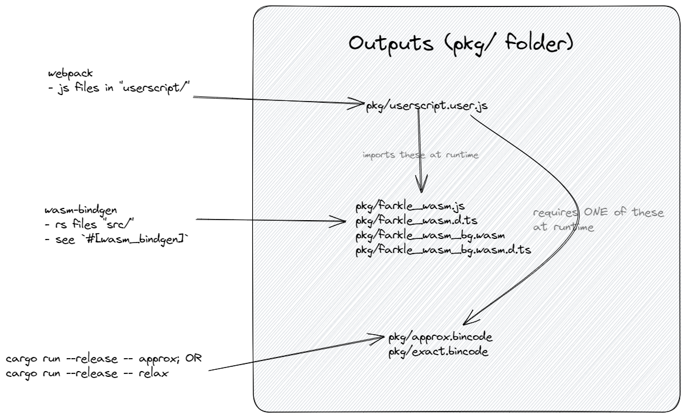

### Running built version
1. Install userscript manager, e.g. [tampermonkey](https://chrome.google.com/webstore/detail/tampermonkey/dhdgffkkebhmkfjojejmpbldmpobfkfo?hl=en)
2. [Install userscript](https://github.com/domsleee/farkle/raw/gh-pages/userscript.user.js) from gh-pages
3. Open https://cardgames.io/farkle/ to see it play

### To develop
1. Run `npm i`
2. Install [wasm-pack](https://rustwasm.github.io/wasm-pack/installer/)
3. Run `cargo install cargo-watch`
4. Run `npm start`
5. Install the userscript
6. Open https://cardgames.io/farkle/ to see it play

It runs three scripts
* `wasm-pack` to compile rust to wasm, exporting to `pkg/`
* `webpack` for the `userscript/` directory, exporting to `pkg/`
* `http-server` of the `pkg/` directory

### Results
JSON.parse(localStorage['farkleSolver.results'])
`{wins: 1260, loss: 974}`

### Design
This project uses `wasm-bindgen` to generate wasm files, which are imported by a user script.

It looks like this:

