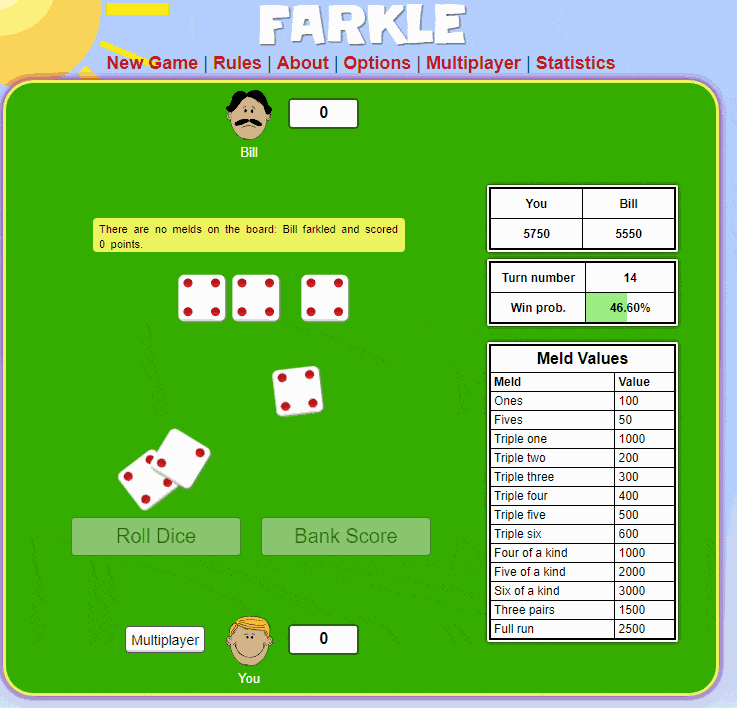

## AI Gameplay (bottom player)

## Running built version
1. Install a userscript manager, e.g. [tampermonkey](https://chrome.google.com/webstore/detail/tampermonkey/dhdgffkkebhmkfjojejmpbldmpobfkfo?hl=en)
2. [Click here](https://github.com/domsleee/farkle/raw/gh-pages/userscript.user.js) to install the userscript from gh-pages
3. Open https://cardgames.io/farkle/ to see it play

## Results
* Expected win rate against a perfect AI when you go first is 53.3% (from `cargo run --release -- exec`)
* Against "Bill" from cardgames.io, 56.4%. So it is a bit stronger (by 3.1%)
  * `JSON.parse(localStorage['farkleSolver.results'])`: `{wins: 1260, loss: 974}`

## Running development version
1. Run `npm i`
2. Install [wasm-pack](https://rustwasm.github.io/wasm-pack/installer/)
3. Run `cargo install cargo-watch`
4. Run `npm start`
5. Install the userscript by opening `pkg/userscript.development.user.js` in your browser (by dragging on to the browser window)
6. Open https://cardgames.io/farkle/ to see it play, making sure only one of the userscripts (`farkle-development`, `farkle-production`) is enabled

## Design
This project uses `wasm-bindgen` to generate wasm files, which are imported by a userscript and run on a game on cardgames.io.

`npm start` has three scripts:
* `wasm-pack` to compile rust to wasm, exporting to `pkg/`
* `webpack` for the `userscript/` directory, exporting to `pkg/`
* `http-server` of the `pkg/` directory, so that the userscript can import the wasm and the cache files

It looks like this:

